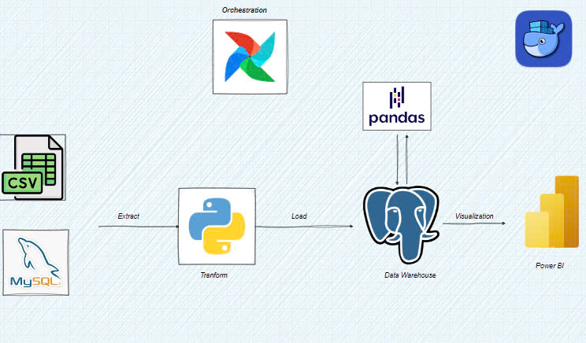
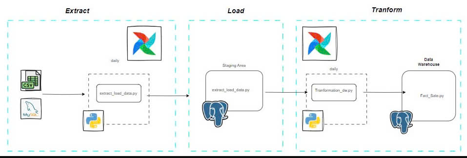

# Automated Data Warehouse Pipeline for E-commerce with Airflow & Docker

<p align="center">
  
</p>

## Table of Contents
- [Introduction](#introduction)
- [Features](#features)
- [Technologies Used](#technologies-used)
- [Setup Instructions](#setup-instructions)
- [Data Pipeline](#data-pipeline)
- [Usage](#usage)
- [Visualizations](#visualizations)
- [Conclusion](#conclusion)
- [Future Direction](#future-direction)
- [Contact](#contact)

## Introduction
This project builds an **automated ELT data pipeline** for e-commerce sales data using Apache Airflow, Docker, and PostgreSQL. It extracts raw data, transforms it into meaningful insights, and loads it into a data warehouse for analytics.

## Features
- **Automated Data Extraction**: Fetch data from CSV files and MySQL databases.
- **Orchestrated Workflows**: Apache Airflow schedules and manages data workflows.
- **Containerized Deployment**: Docker ensures consistent execution across environments.
- **Centralized Data Warehouse**: PostgreSQL stores structured and processed data.
- **Business Intelligence**: Power BI provides visual analytics and reports.

## Technologies Used
- **Python**: For scripting ETL jobs.
- **Apache Airflow**: For orchestrating data pipelines.
- **Docker**: For containerized execution and portability.
- **PostgreSQL**: As the staging and warehouse database.
- **Power BI**: For visualizing business insights.

## Setup Instructions

### Clone the Repository
  ```sh
  git clone https://github.com/hieuchelsea20121997/Automated-Data-Warehouse-Pipeline-for-E-commerce-with-Airflow-Docker.git
  cd Automated-Data-Warehouse-Pipeline
  ```

## Start the Environment
Ensure Docker is installed and running.

### Build and start the containers:
```sh
docker-compose up -d
```

## Access the Airflow UI
Navigate to [http://localhost:8080](http://localhost:8080)

Use default credentials:  
- **Username**: `airflow`  
- **Password**: `airflow`

## Data Pipeline

<p align="center"> 
  
</p>

- **Extract**: Pull raw data from CSV files and MySQL databases.  
- **Load**: Store the data into a PostgreSQL staging area.  
- **Transform**: Clean and structure the data for analysis.  
- **Store**: Load transformed data into the final warehouse schema (ProgresDB).  
- **Visualize**: Generate reports using Power BI.  

## Usage
- **Monitor Airflow DAGs**: Check task execution in the Airflow UI.  
- **Query the Data Warehouse**: Use SQL to extract insights.  
- **Analyze Data in Power BI**: Connect to PostgreSQL and create dashboards.  

## Visualizations
- 📊 Sales performance trends.  
- 🛒 Customer purchasing behavior.  
- 💰 Revenue breakdown by category.  

## Conclusion
This project automates e-commerce data processing and provides actionable insights.  
It ensures scalability, reliability, and efficiency in data-driven decision-making.  

## Future Direction
- ⚡ Integrate real-time data ingestion using Kafka.  
- 🧠 Implement advanced analytics with machine learning models.  
- 🚀 Optimize query performance with indexing and partitioning.  

## Contact
For any questions, feel free to reach out:  
📧 trunghieu201297@gmail.com